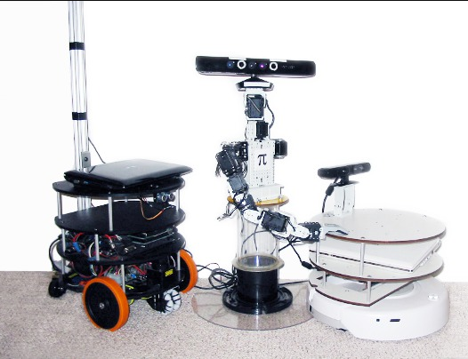
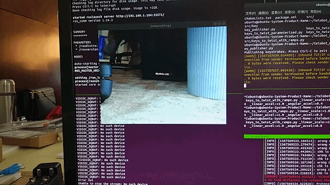

> 这个分支是 Noetic，其他分支可以查看这里 [Kinetic](https://github.com/wuhanstudio/rt-rosserial/tree/kinetic)/[Melodic](https://github.com/wuhanstudio/rt-rosserial/tree/melodic)

### 1. ROS 介绍
**机器人操作系统 ROS** (Robots Operating System) 最早是斯坦福大学的一个软件框架，现在不管是工业机器人，还是娱乐用的机器人都运行着 ROS。

一个机器人通常有很多个部件、传感器，为了保证机器人不会因为某一个传感器故障，导致整个系统瘫痪，所以采用了分布式的节点，利用不同节点之间的通讯收集传感器数据和控制指令，这篇文档后面会使用到的通讯协议就是 **rosserial**。

**rosserial** 可以很方便地让自己的 MCU 用 **USART 有线** 或者 **TCP 无线**  和 ROS 连接，发布传感器信息到 ROS 节点，或者从 ROS 节点订阅传感器信息，例如下面和 ROS 连接后，可以用电脑控制的摄像头小车：

现在可以选择下面2中通信方式中的一种：

- UART
- TCP 

如果使用 TCP 当然要先确保 rt-thread 有网卡设备，并获取到 IP 地址，例如：

- enc28j60 (SPI) + lwip。

### 2. 使用说明

#### 2.1 安装 ROS

首先需要一个比较强劲的CPU用来运行 ROS 的主节点，例如 PC 或者 ARM ，安装过程可以参照 ROS 的[官网](http://wiki.ros.org/ROS/Installation)，现在官方支持最好的还是 Debian 系列。

下面以 Ubuntu 安装 **ROS Melodic** 为例：

依赖：

	sudo apt install python-rosinstall python-rosinstall-generator python-wstool build-essential

安装：  

	sudo sh -c 'echo "deb http://packages.ros.org/ros/ubuntu $(lsb_release -sc) main" > /etc/apt/sources.list.d/ros-latest.list'
	sudo apt-key adv --keyserver hkp://ha.pool.sks-keyservers.net:80 --recv-key 421C365BD9FF1F717815A3895523BAEEB01FA116
	sudo apt update
	sudo apt install ros-melodic-desktop-full

初始化： 

	sudo rosdep init
	rosdep update
	echo "source /opt/ros/melodic/setup.bash" >> ~/.bashrc
	source ~/.bashrc

#### 2.2 启动 ROS

首先启动一个主节点：

	roscore

#### 2.3 建立连接

如果使用的串口：

	rosrun rosserial_python serial_node.py /dev/ttyUSB0

如果使用的 TCP：

	rosrun rosserial_python serial_node.py tcp

#### 2.4 订阅话题

以 hello world 为例：

	rostopic echo /chatter

### 3. 感谢

- rosserial: https://github.com/ros-drivers/rosserial

### 4. 联系方式

* 维护：Wu Han
* 主页：http://wuhanstudio.cc
* 联系：https://github.com/wuhanstudio/rt-rosserial/issues
